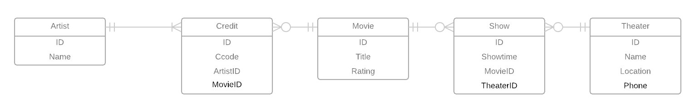

# Data Modeling Note

## Normalization Analysis

### 1NF Conversion
Database(ID,TName, Location, Phone, MTitle, ShowTime, Rating, Ccode, CName, BIO)

### 2NF Conversion
Already done in 1NF
TName --> Location, Phone
MTile --> rating

Theater(ID,TName,Location,Phone)
Movie(ID,MTitle,Rating)

### 3NF Conversion
Already done in 2NF
[TName,TTitle]-->Showtime
MTitle -->--> [Ccode,CName]
Showtime(SID,TheaterID,ShowTime,MovieID)
Credit(CID,MovieID, AID, Ccode)
Artist(AID, Name, Bio)
### BCNF
Already done in 3NF

## Entity Relationship Model.

